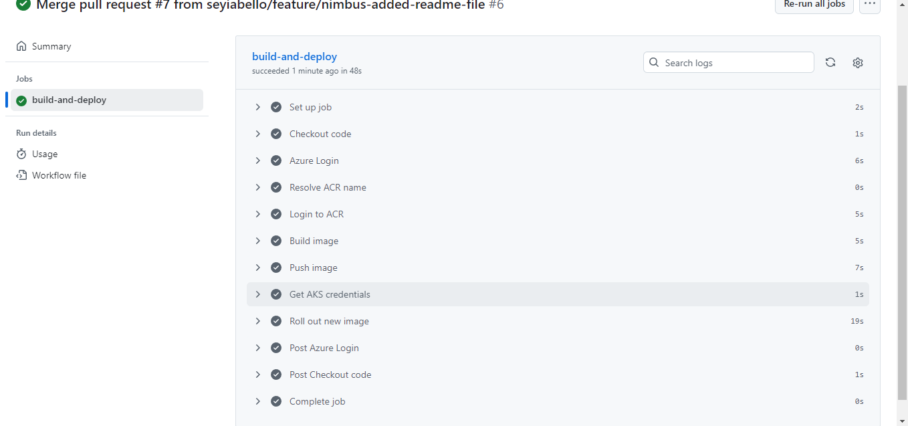
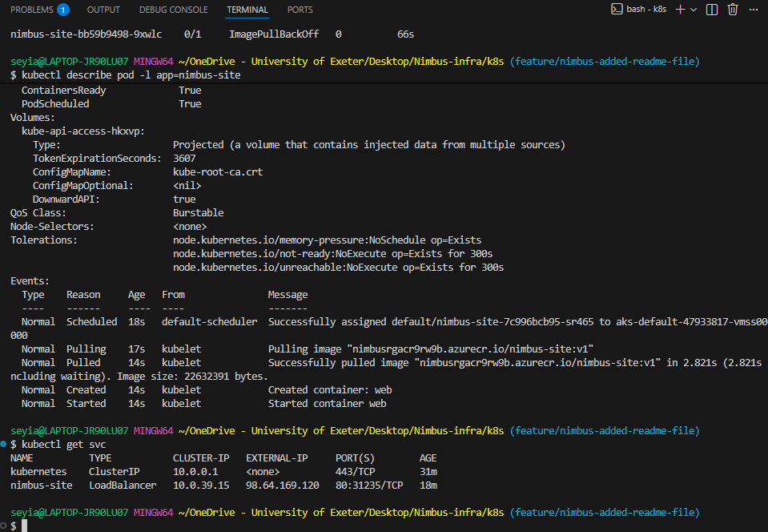
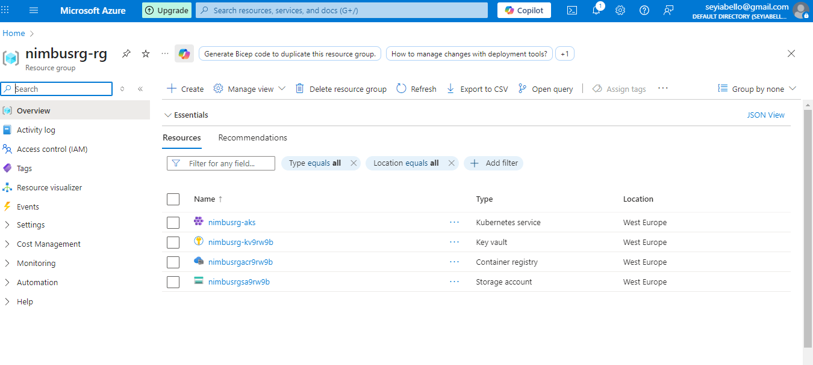
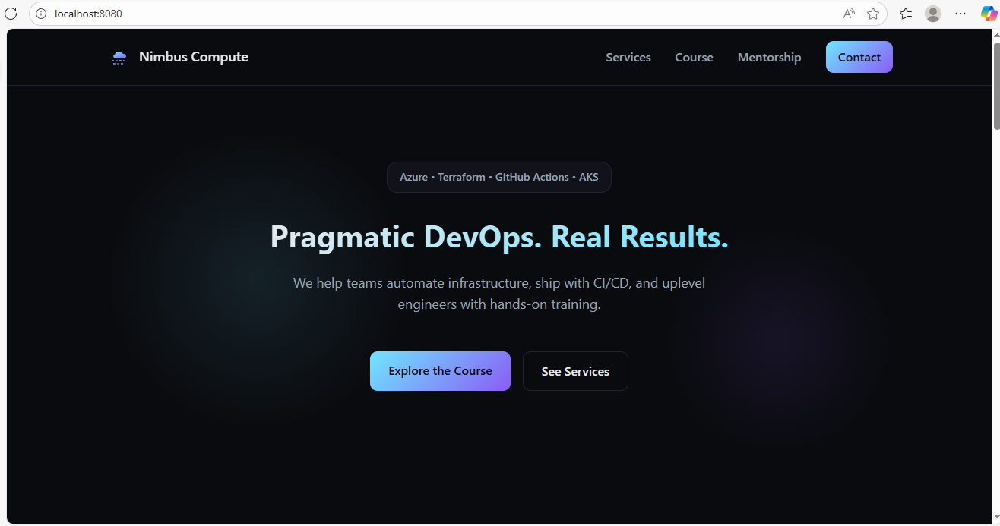

# 🌩️ Nimbus Infrastructure  
## End-to-End Azure DevOps Platform

<p align="center">
  
</p>

<p align="center">
  A production-style Azure DevOps platform demonstrating Infrastructure as Code, containerisation, Kubernetes orchestration, CI/CD automation, security best practices, and observability.
</p>

---

## 🚀 Project Overview

Nimbus Infra is a **full end-to-end DevOps build on Microsoft Azure**, designed to mirror how modern cloud platforms are engineered and operated in real environments.

The project covers the complete lifecycle:
- Infrastructure provisioning with **Terraform**
- Application containerisation with **Docker**
- Deployment and scaling on **Azure Kubernetes Service (AKS)**
- Automated delivery via **GitHub Actions CI/CD**
- Secure configuration using **Azure Key Vault & RBAC**
- Monitoring and observability with **Prometheus & Grafana**

This project demonstrates how I design, deploy, automate, and validate cloud-native systems from scratch.

---

## 🧠 High-Level Architecture

**Flow summary:**
1. Code is written locally and pushed to GitHub
2. Terraform provisions Azure infrastructure using a remote backend
3. GitHub Actions builds and pushes Docker images to Azure Container Registry
4. AKS pulls images and deploys the application via Kubernetes manifests
5. Monitoring stack provides cluster and workload visibility

---

## 🛠️ Tech Stack

**Cloud & Platform**
- Microsoft Azure (AKS, ACR, Key Vault, Storage)

**Infrastructure as Code**
- Terraform (modular configuration, remote state)

**Containers & Orchestration**
- Docker
- Kubernetes (AKS)

**CI/CD**
- GitHub Actions

**Observability**
- Prometheus
- Grafana

---

## 🔁 Automated CI/CD Pipeline

<p align="center">
  
</p>

**Pipeline capabilities:**
- Azure authentication via service principal
- Docker image build
- Push to Azure Container Registry
- Automatic rollout of new image to AKS

This ensures **every commit can trigger a reproducible deployment**.

---

## 🧱 Infrastructure as Code (Terraform)

<p align="center">
  
</p>

Terraform provisions:
- Resource Group
- Azure Kubernetes Service (AKS)
- Azure Container Registry (ACR)
- Azure Key Vault
- Storage Account + Blob container for **remote state**
- Role-Based Access Control (RBAC)

Remote state is securely stored in Azure Blob Storage, enabling safe collaboration and state consistency.

---

## ☸️ Kubernetes Deployment (AKS)

<p align="center">
  
</p>

Kubernetes manifests define:
- Application Deployment
- LoadBalancer Service

The screenshot confirms:
- Image pulled successfully from ACR
- Container started without errors
- External LoadBalancer IP assigned

---

## ☁️ Azure Platform Proof

<p align="center">
  
</p>

All platform components are deployed into a single Azure Resource Group, providing:
- Clear ownership
- Consistent lifecycle management
- Easy teardown and recreation

---

## 🌐 Deployed Application

<p align="center">
  
</p>

The Nimbus site is served via Kubernetes and exposed through an Azure LoadBalancer, demonstrating a complete **infra → app → user** flow.

---

## 📊 Monitoring & Observability

<p align="center">
  
</p>

Prometheus and Grafana are deployed into the AKS cluster to provide:
- Cluster-level metrics
- Application observability
- Foundation for alerting and performance analysis

---

## 📁 Repository Structure

```text
NIMBUS-INFRA
├── .github/
│   └── workflows/
│       └── build.yaml
├── images/
│   ├── buildanddeploy.png
│   ├── Containers.png
│   ├── endtoendupdated.PNG
│   ├── kubernetes1.png
│   ├── nimbus-rg.png
│   ├── site.png
│   └── welcometografana.png
├── k8s/
│   ├── deployment.yaml
│   └── service.yaml
├── monitoring/
│   └── setup-monitoring.sh
├── nimbus-site/
│   ├── index.html
│   ├── styles.css
│   └── nginx.conf
├── terraform/
│   └── *.tf
└── README.md

🔧 How to Deploy Everything
1️⃣ Deploy the Infrastructure
cd terraform
terraform init
terraform plan
terraform apply -auto-approve

2️⃣ Build and Push Docker Image
docker build -t nimbusapp:v1 .
az acr login --name <yourACR>
docker tag nimbusapp:v1 <yourACR>.azurecr.io/nimbusapp:v1
docker push <yourACR>.azurecr.io/nimbusapp:v1

3️⃣ Deploy to AKS
kubectl apply -f k8s/

4️⃣ Install Monitoring Stack
chmod +x monitoring/setup-monitoring.sh
./monitoring/setup-monitoring.sh

🎯 What This Project Demonstrates About My Skills

✔ Cloud Infrastructure Engineering
✔ Terraform IaC (modular, production-level structure)
✔ Docker containerization
✔ Kubernetes deployment
✔ GitHub Actions CI/CD
✔ Azure AAD authentication + RBAC
✔ Monitoring & Observability tooling
✔ Secure secret management using Key Vault
✔ Clean code structure and real DevOps workflows

This project shows my ability to design, automate, and deploy scalable cloud-native systems end-to-end.